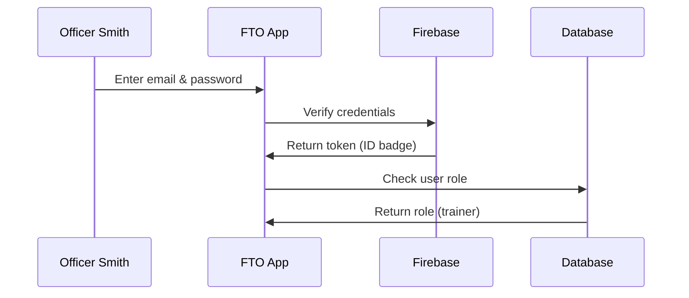

# Authentication & Authorization System

## Why Do We Need Security in Our App?

Imagine you're building a digital police station. Just like a real police station has locked doors, ID badges, and restricted areas, your web application needs similar security measures. Without proper security, anyone could walk in and access sensitive training reports, modify records, or even delete important data!

Let's say Officer Smith wants to submit a training report. The app needs to:
1. **Verify it's really Officer Smith** (not someone pretending to be them)
2. **Check if Officer Smith has permission** to submit reports (maybe they're a trainer, not a trainee)

This is exactly what our Authentication & Authorization System does!

## Breaking Down the Key Concepts

### Authentication: "Who Are You?"

Authentication is like checking someone's ID badge at the police station entrance. It answers the question: "Is this person who they claim to be?"

In our app, when someone types in their email and password, we check with Firebase (think of it as our ID verification service) to make sure they're legitimate.

### Authorization: "What Can You Do?"

Authorization is like checking which rooms someone's keycard can open. Even after we know who you are, we need to know what you're allowed to do.

Our app has three types of users:
- **Admin** 🔑 - Can access everything (like the Chief of Police)
- **Trainer** 📝 - Can create and manage training reports
- **Trainee** 👀 - Can only view their own reports

### Tokens: Your Digital ID Badge

When you successfully log in, Firebase gives you a special "token" - think of it as a temporary ID badge that expires after a while. You need to show this badge every time you try to access something in the app.

## How the Login Process Works

Let's walk through what happens when Officer Smith logs in:



Here's how we handle the login in code:

```javascript
// User enters their credentials
const email = "smith@police.org";
const password = "securePassword123";

// Send to Firebase for verification
const userCredential = await signIn(email, password);
```

When Firebase confirms the login, we get back a user object with a special token inside.

```javascript
// Firebase gives us the user info and token
const user = userCredential.user;
const token = await user.getIdToken();
// Token looks like: "eyJhbGc...very-long-string"
```

Now we check what role this user has in our database:

```javascript
// Look up user's role in Firestore
const userDoc = await getDoc(doc(db, 'users', user.uid));
const role = userDoc.data().role;
// role = "trainer"
```

## Protecting Your App's Routes

Once logged in, every page and API endpoint needs to check if the user has permission to access it. This is like having security checkpoints throughout the police station.

### Edge Protection with Middleware

Our first line of defense is the middleware (found in `middleware.ts`). It's like a security guard at the main entrance:

```javascript
// Check if someone's trying to access admin areas
if (pathname.startsWith('/api/admin/')) {
  const auth = request.headers.get('authorization');
  
  // No badge? No entry!
  if (!auth.startsWith('Bearer ')) {
    return NextResponse.json({ error: 'Unauthorized' });
  }
}
```

This code runs before any admin API request. If there's no token (ID badge), access is immediately denied.

### Deep Security Checks

But having a badge isn't enough - we need to verify it's real and check permissions. Let's look at how the delete user endpoint (`src/app/api/admin/delete-user/route.ts`) does this:

First, it extracts and verifies the token:

```javascript
// Get the token from the request
const authHeader = request.headers.get('authorization');
const idToken = authHeader.substring(7); // Remove "Bearer "

// Verify with Firebase that this token is real
const decodedToken = await verifyIdToken(idToken);
```

Then it checks if the user is a super admin:

```javascript
// Get user's role from database
const userDoc = await db.collection('users')
  .doc(decodedToken.uid).get();
  
const userRole = userDoc.data().role;
```

Finally, it checks special permissions:

```javascript
// Only specific admins can delete users
const isSuperAdminUser = isSuperAdmin(email, userRole);

if (!isSuperAdminUser) {
  return NextResponse.json({ error: 'Forbidden' });
}
```

## How It All Works Under the Hood

When a user tries to perform an action, here's what happens behind the scenes:

1. **User makes a request** (like "Delete User X")
2. **Middleware checks** for a token (quick check at the door)
3. **API route verifies** the token with Firebase (detailed ID check)
4. **Role lookup** in the database (what's your clearance level?)
5. **Permission check** (are you allowed in this room?)
6. **Action executed** or denied based on permissions

The beauty of this system is that even if someone steals a token, it expires quickly. And even with a valid token, they can only do what their role allows.

## The User Experience

From the user's perspective in `src/app/login/page.tsx`:

```javascript
// Check if user is already logged in
if (currentUser) {
  router.push("/"); // Send them to home
}

// Otherwise, show login form
return <LoginForm />;
```

The app remembers you're logged in using the AuthProvider (`src/app/layout.tsx`), which wraps the entire application and keeps track of your authentication state.

## Conclusion

You've just learned how our app keeps data secure! Like a well-guarded police station, we:
- **Verify identities** through Firebase authentication
- **Check permissions** based on user roles
- **Protect every route** with token verification
- **Create audit trails** for sensitive actions

This security foundation ensures that only the right people can access the right information at the right time.

Ready to see what authorized users can actually do? Let's explore how they manage training reports in the [Report Management System](02_report_management_system_.md)!

---

Generated by [AI Codebase Knowledge Builder](https://github.com/The-Pocket/Tutorial-Codebase-Knowledge)