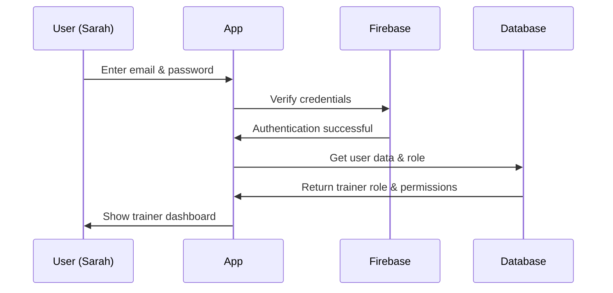

# Authentication & User Management

Welcome to your first chapter in understanding the Field Training system! Today, we'll explore how the application keeps track of who you are and what you're allowed to do - just like how a building's security system works.

## The Problem We're Solving

Imagine you're managing a training center with hundreds of trainees, multiple trainers, and several administrators. You need to:
- Know who's accessing the system
- Remember what each person is allowed to do
- Keep unauthorized people out
- Automatically log people out if they walk away from their computer

Without a proper authentication system, anyone could access sensitive training records or make unauthorized changes. That's where our Authentication & User Management system comes in!

## Key Concepts Explained

### 1. Authentication: "Who Are You?"

Authentication is like showing your ID card at the building entrance. When you log in with your email and password, the system verifies you are who you claim to be.

```javascript
// Simple login example
await login(
  "trainer@example.com", 
  "myPassword123",
  true  // Remember me
);
```

After this code runs, you're "inside the building" - the system knows who you are!

### 2. User Roles: "What's Your Job?"

Just like in a real training center, people have different roles:
- **Trainees**: Can view and submit their own reports
- **Trainers**: Can review trainee reports and provide feedback  
- **Admins**: Can manage users and system settings

```javascript
// Check a user's role
if (role === "trainer") {
  // Show trainer dashboard
} else if (role === "trainee") {
  // Show trainee dashboard
}
```

### 3. Permissions: "What Rooms Can You Enter?"

Even within the same role, different people might have different permissions. Think of it like having keys to specific rooms.

```javascript
// Check if user can manage reports
if (permissions.canManageReports) {
  // Show report management button
}
```

### 4. Session Management: "Remembering You're Here"

Once you log in, the system needs to remember you're authenticated - like getting a visitor badge that you wear while in the building.

## How It All Works Together

Let's walk through what happens when Sarah, a trainer, logs into the system:



## Under the Hood: How Authentication Works

### Step 1: The Login Process

When Sarah clicks "Login", here's what happens in our `AuthContext`:

```javascript
const login = async (email, password, remember) => {
  // 1. Tell Firebase to verify the credentials
  const userCredential = await signInWithEmailAndPassword(
    auth, 
    email, 
    password
  );
  
  // 2. Get the user object if successful
  const user = userCredential.user;
```

This code asks Firebase (our authentication service) to check if the email and password match. If they do, we get back a user object.

```javascript
  // 3. Fetch additional user data from database
  const userDoc = await getDoc(
    doc(db, 'users', user.uid)
  );
  const userData = userDoc.data();
  
  // 4. Store the user's role and name
  setRole(userData.role);
  setUserName(userData.name);
```

After authentication, we fetch Sarah's profile from the database to learn she's a "trainer" and get her display name.

### Step 2: Protecting Pages

Some pages should only be accessible to logged-in users. Our `ProtectedRoute` component acts like a security checkpoint:

```javascript
// Inside ProtectedRoute component
if (!currentUser) {
  // No badge? Send to login
  router.push("/login");
  return null;
}

// Has badge? Show the page
return <>{children}</>;
```

If Sarah tries to access the dashboard without logging in first, she'll be redirected to the login page automatically.

### Step 3: Idle Timeout - The Automatic Logout

Just like a building might lock doors after hours, our system automatically logs users out after 10 minutes of inactivity:

```javascript
// Inside use-idle-timer-native.ts
const IDLE_TIMEOUT = 10 * 60 * 1000; // 10 minutes
const WARNING_TIME = 5 * 60 * 1000;  // 5 minute warning
```

The system watches for user activity (mouse moves, clicks, typing). If Sarah walks away from her desk:

```javascript
// After 5 minutes of no activity
showWarning(); // "You'll be logged out in 5 minutes"

// After 10 minutes total
handleOnIdle(); // Log out and redirect to login
```

### Step 4: Permission Checking

Different users have different abilities. The `permissions.ts` file defines what each role can do:

```javascript
// Trainer default permissions
if (role === 'trainer') {
  return {
    canManageReports: false,
    canPrintPackets: true,
    canCreateInvitations: false
  };
}
```

This means trainers can print training packets but can't manage reports or create invitations for new users.

## The Security Layers

Our authentication system has multiple security checkpoints:

1. **Edge Middleware** (`middleware.ts`): The first guard at the door
   ```javascript
   // Check for admin API routes
   if (pathname.startsWith('/api/admin/')) {
     // Must have authorization token
     if (!auth.startsWith('Bearer ')) {
       return { error: 'Unauthorized' };
     }
   }
   ```

2. **Context Provider** (`AuthContext.tsx`): Manages the user's "badge" throughout the app
3. **Protected Routes**: Individual page guards
4. **Idle Timer**: Automatic security sweep

## Conclusion

You've just learned how the Field Training system manages user identity and access! Think of it as a sophisticated security system that:
- Checks credentials at the door (login)
- Issues badges with specific access levels (roles & permissions)  
- Remembers who's inside (sessions)
- Automatically escorts people out if they're idle (timeout)

This foundation ensures that only the right people can access the right information at the right time.

Ready to see what users actually do once they're logged in? Head to [Training Report System](02_training_report_system_.md) to learn how trainees submit their daily progress and trainers provide feedback!

---

Generated by [AI Codebase Knowledge Builder](https://github.com/The-Pocket/Tutorial-Codebase-Knowledge)