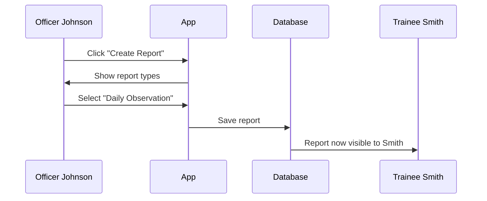
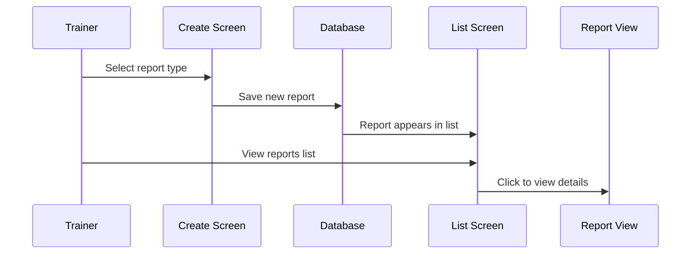

# Report Management System

## Building on Your Security Foundation

In the [previous chapter](01_authentication___authorization_system_.md), you learned how to verify who users are and what they can do - like having ID badges and keycards in a police station. Now that we have secure access control, let's explore what authorized users actually work with: **training reports**!

## The Problem: Organizing Police Training Documentation

Imagine you're a Field Training Officer (FTO) named Officer Johnson. Every day, you train new officers and need to document their progress. Without a system, you'd have:
- 📄 Paper reports scattered everywhere
- 🔍 No way to quickly find past reports
- 😕 Confusion about who can see which reports
- ⏰ Time wasted organizing paperwork

Our Report Management System solves this by creating a **digital filing cabinet** that automatically organizes everything and controls access based on user roles.

## Understanding the Three Report Types

Just like a physical filing cabinet has different drawers for different documents, our system has three types of reports:

### 1. Daily Observation Reports (DOR) 📝
Think of these as daily diary entries about a trainee's performance.

### 2. End of Week Reports (EOWR) 📅
These are like weekly summaries - bigger picture reviews of progress.

### 3. Officer Safety Reports (OSR) 🚨
Special reports for safety concerns or incidents that need immediate attention.

## How the System Works: A Real Example

Let's follow Officer Johnson as they create a Daily Observation Report:



Officer Johnson starts by navigating to the report creation page:

```javascript
// In create-report/page.tsx
const reportTypes = [
  {
    title: "Daily Observation Report",
    href: "/create-report/daily-observation",
  }
  // ... other report types
]
```

The app shows three cards, each representing a report type. When Officer Johnson clicks one, they're taken to a form to fill out the report.

## The Magic of Automatic Filtering

Here's where it gets interesting! The system automatically shows different reports to different users - like having magical filing cabinets that show different contents based on who opens them.

### For Trainees (Like Officer Smith)
They only see reports about themselves:

```javascript
// From dor/page.tsx
if (role === 'trainee') {
  q = query(
    collection(db, 'dors'),
    where('traineeId', '==', currentUser.uid)
  );
}
```

This code says: "If you're a trainee, only show reports where your ID matches the trainee field."

### For Trainers (Like Officer Johnson)
They see reports they created:

```javascript
if (role === 'trainer') {
  q = query(
    collection(db, 'dors'),
    where('createdBy', '==', currentUser.uid)
  );
}
```

This means: "Show me all reports I wrote."

### For Admins (Like Chief Williams)
They see everything:

```javascript
if (role === 'admin') {
  q = query(
    collection(db, 'dors'),
    orderBy('date', 'desc')
  );
}
```

Admins get the master key - they can see all reports in the system!

## Inside Each Report Page

Each report type has its own dedicated page (DOR, EOWR, OSR) that works like a smart filing system. Let's peek inside the Daily Observation Reports page (`dor/page.tsx`):

### Step 1: Check Who's Looking
First, the system checks your role (remember the [Authentication System](01_authentication___authorization_system_.md)?):

```javascript
const { currentUser, role } = useAuth();
```

### Step 2: Fetch the Right Reports
Based on your role, it fetches appropriate reports:

```javascript
const fetchReports = async () => {
  // Build the right query based on role
  let q = /* query based on role */;
  
  // Get reports from database
  const snapshot = await getDocs(q);
};
```

### Step 3: Filter Out Archived Users
The system is smart enough to hide reports for trainees who have graduated or been archived:

```javascript
// Check if trainee graduated
if (traineeData.graduatedFromTraining) {
  return false; // Hide this report
}
```

This keeps your view clean and relevant!

### Step 4: Display in a Nice Table
Reports are shown in an organized table with sorting and search:

```javascript
<ReportDataTable 
  columns={columns} 
  data={reports}
  searchPlaceholder="Search reports..."
/>
```

## Creating New Reports

Only trainers and admins can create reports. The system enforces this with a simple check:

```javascript
// From create-report/page.tsx
useEffect(() => {
  if (role !== 'trainer' && role !== 'admin') {
    router.push('/'); // Send them home!
  }
}, [role]);
```

If a trainee somehow tries to access the create report page, they're automatically redirected away.

When creating a report, trainers see a user-friendly interface with three cards:

```javascript
{reportTypes.map((type) => (
  <Card>
    <CardTitle>{type.title}</CardTitle>
    <Button>
      <Link href={type.href}>Create Report</Link>
    </Button>
  </Card>
))}
```

Each card leads to a specific form for that report type.

## The Complete Flow

Let's trace the complete journey of a report from creation to viewing:



1. **Trainer creates** - Fills out the form
2. **System saves** - Stores in Firestore database
3. **Auto-appears** - Shows up in appropriate lists
4. **Filtered viewing** - Right people see right reports
5. **Click for details** - Full report view available

## Smart Features You Get for Free

The Report Management System includes several smart features:

### Auto-generated Report IDs
Each report gets a unique ID automatically:
```javascript
reportId: "DOR-2024-001"
```

### Date-based Sorting
Reports are automatically sorted by date, newest first:
```javascript
orderBy('date', 'desc')
```

### Search Functionality
Users can search by trainee name, trainer name, or report ID - no more digging through piles of paper!

## Conclusion

You've just learned how our Report Management System works like a smart, digital filing cabinet! It:
- **Organizes** three types of training reports
- **Automatically filters** what each user can see
- **Protects** report creation to authorized users only
- **Provides** easy searching and sorting

Just like how the [Authentication System](01_authentication___authorization_system_.md) controls who gets in the door, the Report Management System controls what they can see and do once inside. Together, these systems create a secure, organized environment for police training documentation.

With these foundational systems in place, you're ready to build powerful features on top of them. The combination of secure access and organized data management forms the backbone of the entire Field Training application!

---

Generated by [AI Codebase Knowledge Builder](https://github.com/The-Pocket/Tutorial-Codebase-Knowledge)