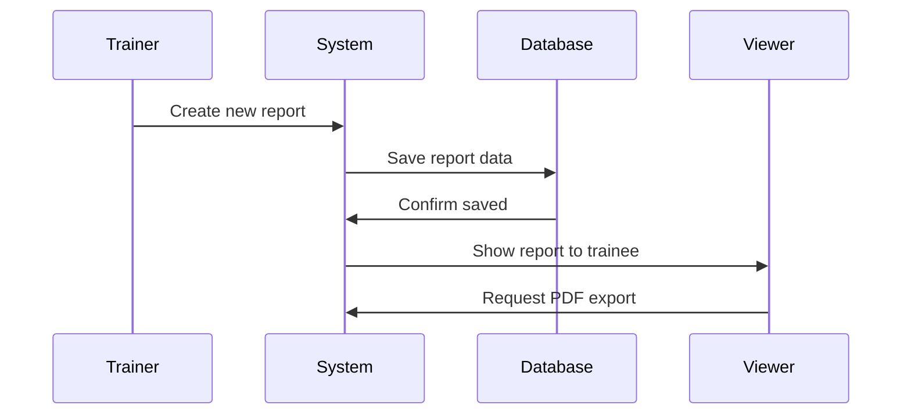
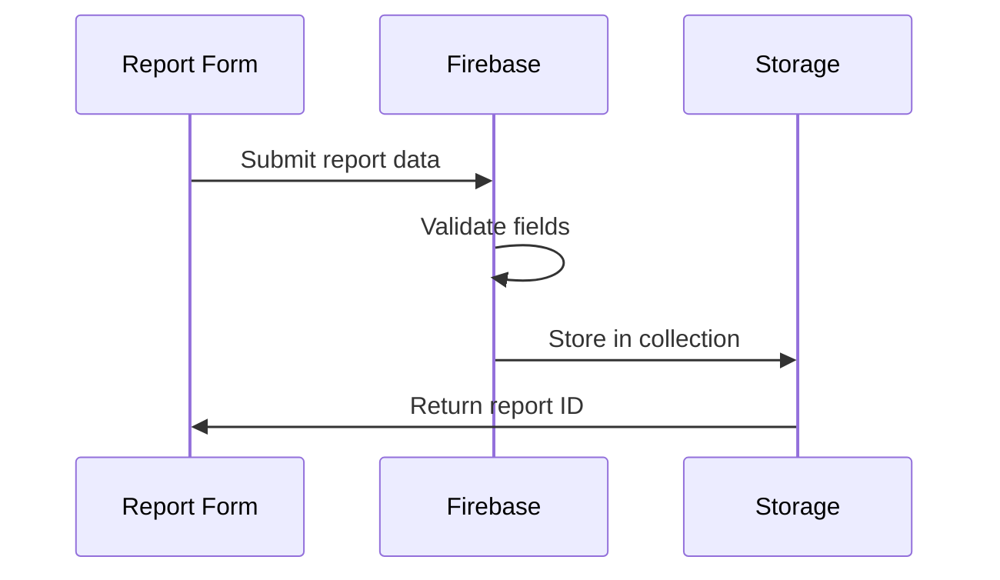

# Training Report System

Welcome back! In the [previous chapter](01_authentication___user_management_.md), we learned how the system knows who you are and what you're allowed to do - like a digital security system. Now that you're logged in, let's explore what you can actually DO in the system: manage training reports!

## The Problem We're Solving

Imagine you're Officer Johnson, a Field Training Officer (FTO). Every day, you train new police officers and need to document their progress. Without a system, you'd be drowning in paper forms:
- Daily observation notes scattered across different notebooks
- Weekly summaries filed in various cabinets  
- Safety incident reports lost in email chains
- No easy way to track a trainee's improvement over time

Our Training Report System is like having a smart digital filing cabinet that organizes everything automatically and never loses a report!

## Key Concepts Explained

### 1. The Three Types of Reports

Think of training reports like different types of medical records at a doctor's office:

**Daily Observation Report (DOR)** - Like a daily checkup note
```javascript
// A trainer creates a DOR after each shift
const dorReport = {
  date: "2024-01-15",
  trainee: "Officer Smith",
  shiftLength: 8, // hours
  observations: "Good traffic stop technique"
};
```

**End of Week Report (EOWR)** - Like a weekly health summary
```javascript
// Created every week to track overall progress
const weeklyReport = {
  weekEnding: "2024-01-21", 
  weekSummary: "Trainee showing improvement",
  goals: "Work on report writing speed"
};
```

**Officer Safety Report (OSR)** - Like an incident report at a hospital
```javascript
// Only created when safety issues occur
const safetyReport = {
  incidentDate: "2024-01-16",
  description: "Near miss during pursuit",
  concerns: "Need more defensive driving practice"
};
```

### 2. Report Lifecycle: From Creation to PDF

Each report goes through a journey, like a package being shipped:



## How to Use the Report System

Let's walk through how Trainer Johnson documents Trainee Smith's progress:

### Step 1: Creating a Daily Report

When Johnson finishes a shift with Smith, he creates a DOR:

```javascript
// Simple report creation
await createDOR({
  traineeId: "smith123",
  date: new Date(),
  shiftLength: 8
});
```
This saves a new daily report to the database, like filing a form in the right folder.

### Step 2: Viewing Reports

Smith can log in and see all reports about him:

```javascript
// The system automatically filters reports
if (role === "trainee") {
  showReports(myTraineeId); // Shows only Smith's reports
}
```
The system acts like a smart assistant that knows exactly which files to show each person.

### Step 3: Exporting to PDF

Need a physical copy? The system can generate PDFs instantly:

```javascript
// Generate PDF with one click
const pdfData = await generateDORPdf(reportId);
// Downloads "DOR_2024-01-15.pdf" to computer
```

## Under the Hood: How Reports Work

### The Report Storage System

When a trainer submits a report, here's what happens behind the scenes:



### Step 1: Report Organization in Database

The system organizes reports like a filing cabinet with three drawers. In `ReportsOverview.tsx`:

```javascript
// Three separate "drawers" for reports
const reportSections = [
  { title: "Daily Reports", data: dors },
  { title: "Safety Reports", data: osrs },
  { title: "Weekly Reports", data: eowrs }
];
```
Each type of report lives in its own collection, making them easy to find.

### Step 2: Smart Report Display

The `ReportItem.tsx` component figures out what type of report it's showing:

```javascript
const getReportType = () => {
  if (report.shiftLength) return 'dor';     // Has shift hours? It's a DOR
  if (report.incidentDescription) return 'osr'; // Has incident? It's an OSR
  return 'eowr';                            // Otherwise, it's a weekly report
};
```
Like a smart mailroom clerk who knows which department gets which type of mail!

### Step 3: Quick Preview Feature  

Users can peek at reports without opening them fully:

```javascript
// In ReportItem.tsx - Quick look popup
<Popover>
  <PopoverTrigger>
    <Eye icon /> {/* Click for preview */}
  </PopoverTrigger>
  <PopoverContent>
    {getReportSummary()} {/* Shows key info */}
  </PopoverContent>
</Popover>
```
It's like reading the summary on the back of a book before opening it.

### Step 4: PDF Generation Magic

When you click "Download PDF", the system assembles all the data. From `ReportItem.tsx`:

```javascript
// Fetch full report data
const dorDoc = await getDoc(doc(db, 'dors', reportId));
const dorData = dorDoc.data();

// Generate PDF with all information
await generateDORPdf(dorData);
// PDF downloads automatically!
```

### Step 5: Performance Tracking for Weekly Reports

Weekly reports are special - they automatically calculate performance trends. The `fetchEOWRPerformanceData.ts` file:

```javascript
// Find all daily reports for this week
const dorsThisWeek = await getDocs(
  query(dors, 
    where('traineeId', '==', traineeId),
    where('date', '>=', weekStart))
);

// Calculate performance scores
const scores = calculateAverages(dorsThisWeek);
```
The system acts like a report card generator, automatically calculating grades from daily work.

## Smart Search Features

The `SearchPopover.tsx` component lets users find reports quickly:

```javascript
// Search by trainee name
if (searchQuery === "Smith") {
  // Shows all of Smith's reports
}

// Search by date
if (searchQuery === "2024-01-15") {
  // Shows all reports from that day
}
```

It's like having a librarian who instantly knows where every book is!

## Special Features for Different Roles

The system shows different things based on who's logged in:

```javascript
// In ReportsOverview.tsx
const getReportsTitle = () => {
  if (role === 'trainer') 
    return "Reports You've Written";
  if (role === 'trainee') 
    return "Your Training Reports";
  return "All Reports";
};
```

Like having personalized folders that show exactly what you need to see.

## Graduation System

When a trainee completes training, the `graduationUtils.ts` system:

```javascript
// Calculate total training time
const trainingHistory = {
  totalHours: 520,
  totalReports: { dors: 65, eowrs: 13, osrs: 2 }
};

// Graduate the trainee
await graduateTrainee({
  userId: "smith123",
  newRole: "trainer" // Smith becomes a trainer!
});
```

It's like a graduation ceremony where all your academic records are automatically compiled!

## Conclusion

You've just learned how the Training Report System works! Think of it as a smart filing system that:
- Organizes three types of training documents (DOR, EOWR, OSR)
- Automatically shows the right reports to the right people
- Generates PDFs instantly when needed
- Tracks performance over time
- Handles graduation when training is complete

This system transforms mountains of paperwork into an organized, searchable, digital library that never loses a document and always knows exactly what to show each user.

The journey doesn't end here! With users logged in and reports being created, managed, and viewed, you now have a complete understanding of the core Field Training system. You've mastered how authentication protects the system and how reports flow through it - congratulations on completing this training guide!

---

Generated by [AI Codebase Knowledge Builder](https://github.com/The-Pocket/Tutorial-Codebase-Knowledge)