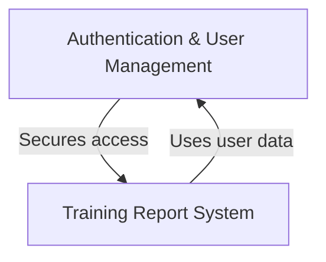

# Field Training Next - Documentation

A **police training management system** that helps track and document the progress of *trainee officers* through their field training program. The system allows **trainers (FTOs)** to create various types of training reports like *Daily Observation Reports*, *End of Week Reports*, and *Officer Safety Reports* to document trainee performance. It includes **secure authentication** with automatic logout for idle users, role-based permissions, and the ability to search, view, and export reports as PDFs for official documentation.

**Source Repository:** [https://github.com/orhanbiler/field-training-next](https://github.com/orhanbiler/field-training-next)

## Chapters

1. [Authentication & User Management
](01_authentication___user_management_.md)
2. [Training Report System
](02_training_report_system_.md)

---

Generated by [AI Codebase Knowledge Builder](https://github.com/The-Pocket/Tutorial-Codebase-Knowledge)